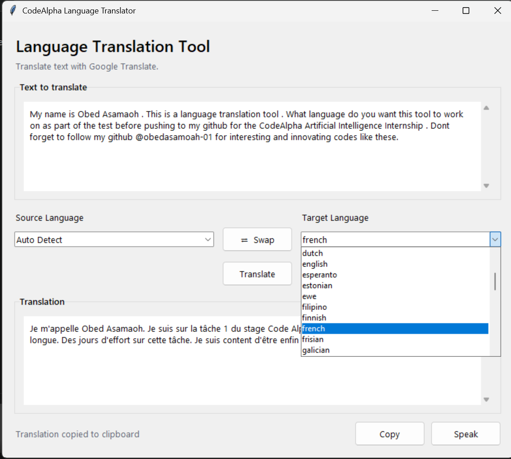
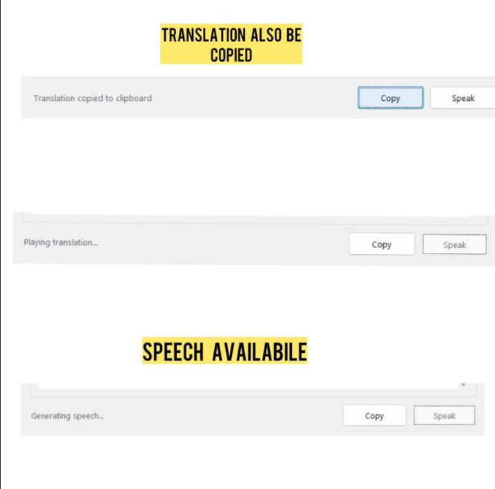

# CodeAlpha Language Translation Tool

A desktop GUI application that translates text between languages in real time, developed as part of the CodeAlpha Artificial Intelligence Internship.

Repository: https://github.com/obed-asamoah01/CodeAlpha_Language-Translation-Tool


## Project Objective
The goal of this project is to build a functional Language Translation Tool that allows a user to enter text, select a source and target language and receive an accurate translation instantly. The project demonstrates how to integrate a third-party translation API into a simple, user-friendly desktop application, a foundational skill in applied AI and NLP tooling.


## Features
- Simple, clean text input box for entering text to translate
- Dropdown selectors for source and target languages (18+ languages supported)
- Auto-detect source language option
- One-click swap button to reverse source and target languages
- Real-time translation via the Google Translate engine
- Copy-to-clipboard button for the translated output
- Optional text-to-speech playback of the translated text
- Background threading so the interface remains responsive during translation
- Lightweight desktop application; no browser or server required


## Technologies

| Category | Tool / Library |
|---|---|
| Language | Python 3 |
| GUI Framework | Tkinter (tkinter, ttk) |
| Translation Engine | deep-translator (Google Translate) |
| Text-to-Speech | gTTS (Google Text-to-Speech) |
| Audio Playback | playsound |
| Concurrency | Python threading module |


## How It Works
1. The user types or pastes text into the input box.
2. The user selects a source language (or leaves it on Auto Detect) and a target language from the dropdown menus.
3. On clicking Translate, the application sends the text and language codes to the deep-translator library, which queries Google Translate's engine over the internet.
4. The translated text is returned and displayed in the output box.
5. The translation runs on a background thread, so the interface remains responsive while awaiting the API response.
6. The user may then copy the translated text to the clipboard or use the Speak function to have it read aloud via Google's text-to-speech service.


## Installation

### Prerequisites
- Python 3.8 or higher
- An active internet connection (required for translation and text-to-speech)

### Steps

1. Clone the repository:
   ```bash
   git clone https://github.com/obed-asamoah01/CodeAlpha_Language-Translation-Tool.git
   cd CodeAlpha_Language-Translation-Tool
   ```

2. Create a virtual environment (recommended):
   ```bash
   python -m venv venv
   source venv/bin/activate      # On Windows: venv\Scripts\activate
   ```

3. Install dependencies:
   ```bash
   pip install -r requirements.txt
   ```


## Usage

1. Run the application:
   ```bash
   python translator_gui.py
   ```
2. Enter the text to be translated in the input text box.
3. Select the source language (or "Auto Detect") and the target language from the dropdown menus.
4. Click Translate to display the result in the output box.
5. Use Copy to copy the translation, or Speak to hear it read aloud.
6. Use Clear to reset both text boxes, or the swap button to reverse the selected languages.


## Screenshots
**Main Window**


**Speech and Copying**



## Limitations
- Requires an active internet connection; there is no offline translation mode.
- Uses the free, unofficial Google Translate web endpoint via deep-translator, which may be rate-limited or occasionally unavailable under heavy use. For production deployment, this may be replaced with the official Google Cloud Translation API or Microsoft Translator API.
- Text-to-speech quality and language coverage are dependent on Google's gTTS service.
- The language list in the dropdown menus is a curated subset, not the full list of languages supported by Google Translate.
- No translation history or saved-session functionality is currently implemented.


## Author
Obed Asamoah
GitHub: https://github.com/obed-asamoah01


